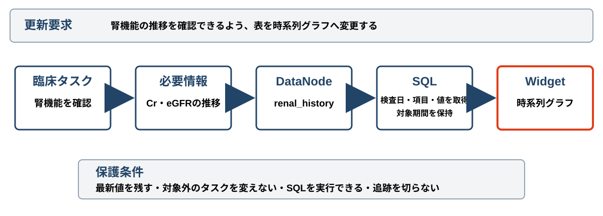

<!-- _class: cover -->
<!-- _paginate: false -->

# 監査可能な臨床UI更新を
# どう評価するか

###### 研究質問と評価設計の整理 · 2026-08-14

#### 京都大学大学院 情報学研究科 · 平田 蓮

<!--
今日の目的は、実装の進捗報告ではなく、CHI 2027へ向けた研究質問と評価設計の確認です。
-->

---

<!-- _class: summary -->

# 今回の要点

| 観点 | 内容 |
| --- | --- |
| 問題 | 生成したUIを更新すると、臨床上必要な依存関係を壊すおそれがある |
| 方針 | 追跡関係と保護条件を使い、更新前に影響と違反を検査する |
| 評価 | 更新制御をRQ1、人による更新判断をRQ2として分けて検証する |
| 相談 | 比較の公平性と、人を対象とする評価の実施可能性を確認したい |

<!--
グラフを使うこと自体を成果にしません。更新を安全に制御できるか、その根拠を人が確認できるかを分けて評価します。
-->

---

<!-- _class: comparison -->

# 7月24日から研究の中心を変えた

1. 7月24日の方針

   提案UIと既存EHRの利用比較と、
   UI更新の技術評価を分ける。

   生成UIの利用効果も主な対象に置く。

2. 8月14日の方針

   更新制御をRQ1、更新を確認する人への
   支援をRQ2として組み合わせる。

   既存EHRとの利用比較は将来評価へ移す。

<!--
前回の二分法は、利用効果と機構の寄与を分ける点では維持します。ただし、CHIの主張は監査可能な更新に絞ります。
-->

---

<!-- _class: procedure -->

# 議論は五つの確認を経て現在案になった

1. KLMでは操作経路しか評価できない
2. 利用効果と提案機構の評価を分ける
3. タスク駆動UIと意味中間表現の先行研究を確認する
4. 臨床UI更新の追跡と保護へ貢献を絞る
5. 更新制御をRQ1、人の判断支援をRQ2にする

<!--
KLMの限界から評価を分け、さらに近接研究との重なりを確認した結果、臨床UI更新の監査へ焦点を移しました。
-->

---

<!-- _class: summary citation -->

# グラフを挟むだけでは新規性にならない

| 研究 | すでに示したこと | 本研究で残る問い |
| --- | --- | --- |
| Jelly | タスク駆動モデルによるUI生成と継続的な変更 | 臨床上の保護条件と層間の追跡を守れるか |
| SimStep | 複数グラフを人が確認・修正するチェックポイント | 臨床UI更新を受理・拒否・修復できるか |
| Bridging Gulfs | 意味表現がUI生成の理解と制御を支援 | 影響範囲と根拠の提示が更新判断を助けるか |

> Cao et al., CHI 2025, DOI: 10.1145/3706598.3713285 · Kaputa et al., CHI 2026, DOI: 10.1145/3772318.3791514 · Park et al., CHI 2026, DOI: 10.1145/3772318.3791966

<!--
三つの研究により、タスク駆動モデル、複数グラフ、人が意味表現を介して制御する価値はすでに示されています。本研究は臨床UI更新の保護と監査に限定します。
-->

---

<!-- _class: visual -->

# 評価するのは層をまたぐ追跡と保護

変更対象だけを更新し、臨床タスクから表示までの関係を保つ

<!--
臨床タスク、必要情報、DataNode、SQL、Widgetを一続きの依存関係として扱います。更新要求の対象と、変えてはいけない保護条件を分けて検査します。
-->

---

<!-- _class: comparison -->

# 二つの研究質問を別の比較で検証する

1. RQ1　更新制御

   同じ更新要求と安全要件の下で、
   グラフ経由の更新は直接差分更新より
   依存関係の破壊を抑えられるか。

2. RQ2　人による更新判断

   影響範囲、根拠、保護条件の提示は、
   成果物差分だけの提示より
   検出、判断、修復を支援できるか。

<!--
RQ1は更新機構の技術評価、RQ2は人への効果を調べるHCI評価です。比較条件と主要評価を混ぜません。
-->

---

<!-- _class: summary -->

# RQ1はグラフ方式と直接差分方式を比べる

| 観点 | 固定する内容 |
| --- | --- |
| 比較 | 成果物への直接差分更新と、グラフを介する差分更新 |
| 共通条件 | 初期UI、更新要求、安定ID、安全要件、一般検査 |
| 候補 | 共通変更仕様から意味上対応する二種類の差分を作る |
| 除外 | 主比較ではGeminiを呼ばず、UI全体も再生成しない |

<!--
直接差分方式にも同じ安全要件を成果物レベルで実装します。グラフ方式だけに検査を与える比較にはしません。
-->

---

<!-- _class: procedure callout -->

# RQ1では受理と拒否を別々に測る

1. 共通仕様、正解、対応差分を凍結する
2. 各方式へ一回ずつ適用する
3. 独立した意味判定で採点する

> ## 主要評価
>
> - 違反候補がUIへ流出した割合
> - 正しい候補を受理できた割合
> - 違反の種類ごとの失敗例

検査を一つずつ外す比較は要因分析として扱う

<!--
違反を止めるだけなら、すべて拒否する方式が良く見えます。そのため、違反流出率と正常受理率を必ず分けます。
-->

---

<!-- _class: summary -->

# RQ2は更新を確認する人への支援を比べる

| 観点 | 内容 |
| --- | --- |
| 基準条件 | 更新要求、更新後UI、成果物差分、一般検査の結果を示す |
| 提案条件 | 基準条件に影響範囲、根拠、保護条件、違反箇所を加える |
| 課題 | 更新の受理・拒否、問題箇所の特定、修復、確信度の回答 |
| 対象候補 | 医療者または臨床情報を判断できる専門家 |

<!--
両条件で同じ更新候補を使います。提案条件だけが正しい候補を見るといった不公平を避けます。
-->

---

<!-- _class: procedure callout -->

# RQ2は正しい判断と修復を中心に測る

1. 更新候補と正解条件を凍結する
2. 二条件で受理・拒否を判断する
3. 問題箇所を特定して修復する

> ## 主要評価と停止条件
>
> - 不適切な更新を誤って受理した割合
> - 受理・拒否判断の正答率
> - 倫理と実施許可が不明なら開始しない

判断時間と確信度は正確性と対応付けて解釈する

<!--
時間短縮だけを主要評価にしません。速い誤判断を高く評価しないため、誤受理と判断の正しさを先に見ます。
-->

---

<!-- _class: parallel -->

# 二つの評価で一つの主張を支える

## RQ1　更新を制御できるか

1. 違反をUI反映前に検出する
2. 正しい更新を過剰に拒否しない
3. どの検査が効いたかを分ける

## RQ2　人が判断できるか

1. 不適切な更新を検出して拒否する
2. 壊れた関係を特定する
3. 根拠を確認して修復する

機械の検査と人の判断を合わせて監査可能性を評価する

<!--
RQ1だけでは人への価値を示せず、RQ2だけでは更新機構の働きを分離できません。二つを分けて実施し、最後に限定した主張へ統合します。
-->

---

<!-- _class: comparison -->

# 主張する範囲を先に限定する

1. 評価から主張したいこと

   合成症例と凍結した更新候補で、
   依存関係を守りながら更新できるか。

   影響表示が専門家の判断を支援するか。

2. この評価だけでは主張しないこと

   グラフという保存形式の一般的な優位性。

   臨床転帰、実運用上の安全性、
   他診療科や現行EHRへの一般化。

<!--
評価結果が良くても、合成症例と対象参加者の範囲を超えて結論を広げません。
-->

---

<!-- _class: timeline -->

# CHI 2027へ向けた判断期限

1. 研究質問、倫理、参加者候補を確認 `8月17日`
2. 比較条件、安全要件、評価手順を固定 `8月20日`
3. 技術評価版と人対象評価の実施可能性を確認 `8月27日`
4. 方法、結果、図表を原稿へ反映 `9月2日`
5. CHI 2027 Papersへ提出 `9月10日 AoE`

<!--
8月27日までに評価版を固定できない場合は、CHIフルペーパーへの投稿可否を再判断します。
-->

---

<!-- _class: callout -->

# ゼミで確認したいこと

> ## 三つの判断を相談したい
>
> - RQ1とRQ2の組合せでCHIの貢献を説明できるか
> - 同じ安全要件を持つ直接差分方式は公平な基準条件か
> - RQ2の倫理確認、参加者確保、実施を締切前に進められるか

<!--
この三点が決まれば、8月20日までに比較仕様と評価手順を固定できます。
-->
