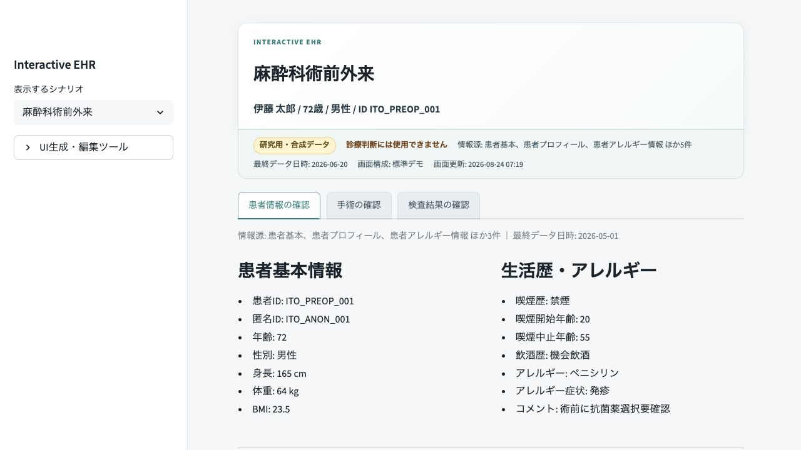
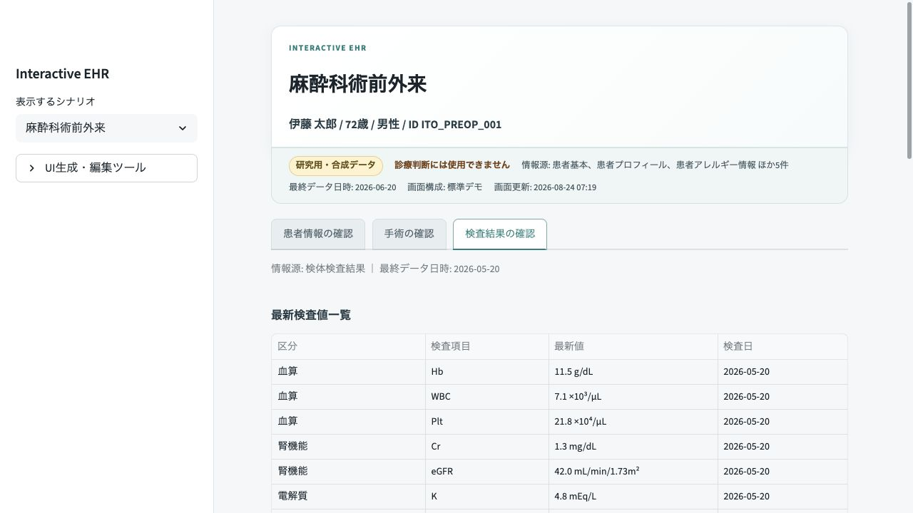
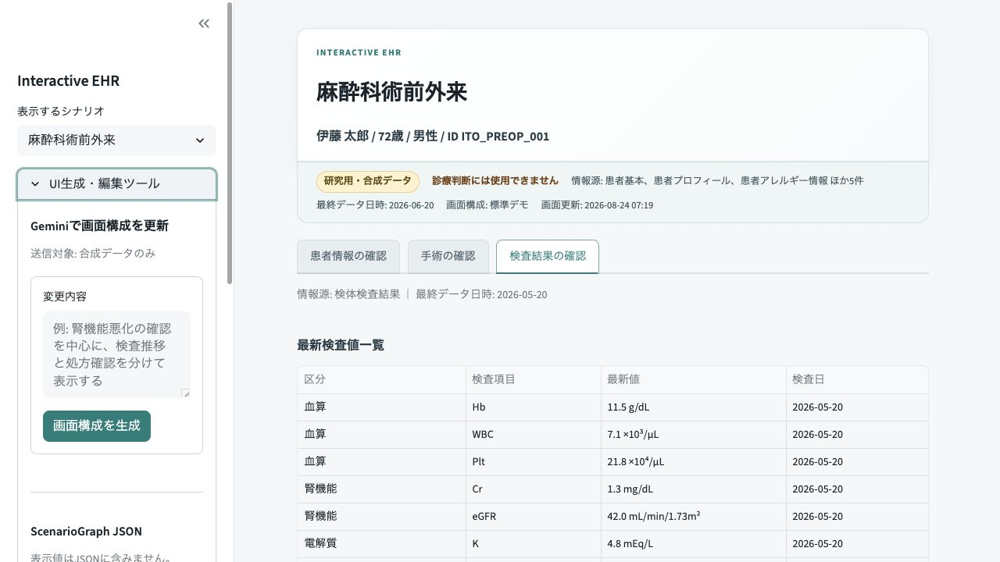
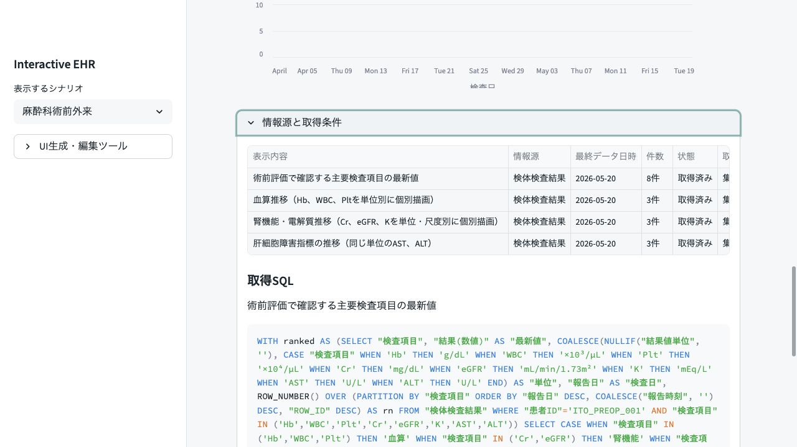

<!-- _class: cover -->
<!-- _paginate: false -->

# インタラクティブなUI生成システムのデモ

###### 2026-08-24

#### 平田 蓮

---

<!-- _class: summary accent-labels -->

# 今回お見せできる状態

| 項目 | 内容 |
| --- | --- |
| 対象 | 麻酔科術前外来の合成症例 |
| 操作 | 患者情報、手術情報、検査結果の確認と画面構成の更新 |
| 確認 | 情報源、データ時点、取得条件まで画面内で確認 |

---

<!-- _class: comparison -->

# 必要な情報へたどり着く画面を変える

1. 固定された画面

   必要な情報が複数画面や記録へ分かれる。

   利用者が場所と操作経路を覚えて探す。

2. タスクに合わせた画面

   確認したい内容から必要なデータを集める。

   一覧、表、推移を同じ診療場面にまとめる。

---

<!-- _class: architecture -->

# 変更要求からデータ付きUIを組み立てる

1. 変更要求

   利用者が確認したい内容を入力する。

2. ScenarioGraph

   診療場面、タスク、データ、表示部品を構造化する。

3. データ取得と描画

   SQLを実行し、結果を表やグラフとして描画する。

---

<!-- _class: summary -->

# 麻酔科術前外来の合成症例で確認する

| 画面 | 表示する情報 |
| --- | --- |
| 患者情報 | 基本情報、生活歴、アレルギー、既往歴、処方、麻酔歴 |
| 手術情報 | 予定日、依頼診療科、病名、術式、体位、麻酔科依頼 |
| 検査結果 | 最新値と血算、腎機能、電解質、肝機能の推移 |
| 位置づけ | 3つのタブは表示区分。臨床タスクは専門家と別途確定 |

---

<!-- _class: visual-pair -->

# 診療場面を保ったまま確認対象を切り替える

患者情報

検査結果

患者とデータ時点を上部へ固定し、タブごとに必要な情報をまとめる

---

<!-- _class: visual -->

# 変更内容を入力して画面構成を更新する

変更要求からScenarioGraphとSQLを更新し、有効な構成だけを描画する

---

<!-- _class: visual -->

# 表示値の根拠を同じ画面で確認する

情報源、最終データ日時、件数、欠損状態、取得SQLを表示する

---

<!-- _class: progress -->

# デモに必要な機能を実装した

1. ScenarioGraphからStreamlit UIを描画 `実装済み`
2. Geminiによる画面構成とSQLの更新 `実装済み`
3. 患者文脈とデータ来歴の表示 `実装済み`
4. 麻酔科術前外来と慢性疾患外来の合成デモ `動作確認済み`

---

<!-- _class: procedure -->

# 当日のデモは4つの操作で進める

1. 麻酔科術前外来の合成症例を開く
2. 患者情報、手術情報、検査結果を切り替える
3. 情報源と取得条件を開く
4. 変更内容を入力して画面構成を更新する `接続設定時`

---

<!-- _class: callout -->

# 先生方に確認いただきたいこと

> ## 診療で使う画面として見る
>
> - 術前外来で必要な情報がそろっているか
> - 情報のまとまりと確認順序が自然か
> - 見落としてはいけない情報が目立つか
> - 情報源とデータ時点の表示で根拠を確認できるか

---

<!-- _class: comparison -->

# 現在はシステムデモの段階

1. 確認できたこと

   合成データで画面を表示、更新できる。

   162件のテストに合格し、参照元16項目中11項目を追跡した。

2. これから確認すること

   臨床タスクと必要情報を専門家と確定する。

   実患者情報は使わず、院内配備と評価を別途進める。
