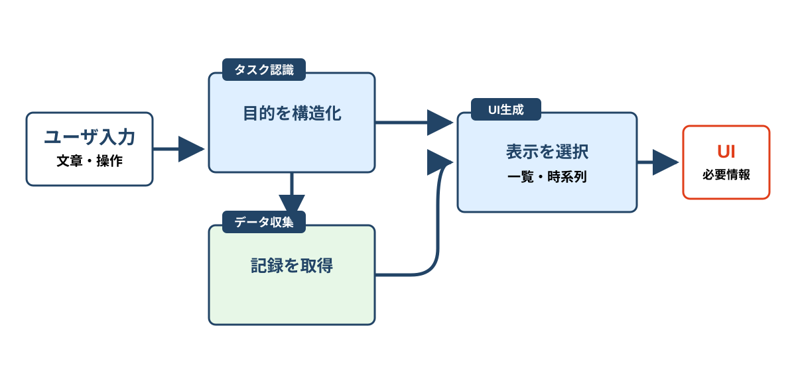

<!-- _class: cover -->

# Research Theme

###### コンポーネント一覧 · 2026-07-17

#### Markdownで編集できる研究スライド

---

<!-- _class: section -->

# Research Theme

- **Architecture**
- Methods
- Procedure

---

<!-- _class: summary -->

# 研究テーマ

| 項目 | 内容 |
| --- | --- |
| 背景 | 電子カルテには診療に必要な情報が分散している |
| 目的 | 必要な情報へ到達するまでの操作を減らす |
| 方法 | タスクに合わせて情報とUIを構成する |

---

<!-- _class: summary focus -->

# 研究テーマ

| 項目 | 内容 |
| --- | --- |
| 背景 | 情報探索に時間がかかる |
| **目的** | 適切な情報だけを提示する |
| 方法 | タスクに基づいてUIを生成する |

---

<!-- _class: summary accent-labels -->

# 実験設定

| 項目 | 内容 |
| --- | --- |
| 仮説 | 情報探索に必要な操作が減る |
| 実験 | 固定したタスクを2条件で行う |
| 評価 | 操作時間と誤りを比較する |

---

<!-- _class: statement -->

# 背景

| 項目 | 内容 |
| --- | --- |
| 背景 | 固定画面では必要な情報を複数画面から探す |

| 現状 | 課題 |
| --- | --- |
| オーダー管理として実装 | **可視化の観点では不十分** |

> 必要な情報を適切に可視化して探索負荷を減らす

---

<!-- _class: pipeline -->

# UI生成の流れ

1. **タスク**

   診療時に達成したい内容

2. **データ**

   タスクに必要な記録

3. **UI**

   一覧表示または時系列表示

---

<!-- _class: procedure -->

# 研究の進め方

1. UI生成システムを作成 `実装`
2. タスクからデータを集める方法を検討 `検証`
3. ユーザ入力からタスクを認識

---

<!-- _class: flow -->

# 院内環境への組み込み

1. Dockerイメージを作成
2. 院内サーバーへ転送
3. コンテナを起動
4. **クライアントから接続確認**

---

<!-- _class: procedure callout -->

# 修論に向けた実験計画

1. 有識者へ意見聴取
2. タスクグラフを作成
3. 生成UIを評価
4. 独自モデルを検証

> ## 効果検証実験
>
> 1. 医療従事者へ協力を依頼する
> 2. 複数シナリオへ提案システムを適用する
> 3. 従来画面との操作差を比較する

タスクベースのUI生成から検証を進める

---

<!-- _class: parallel -->

# 今後の進め方

## UI生成の検証

1. シナリオ作成を依頼
2. グラフを作成
3. UI生成を評価

## 自動生成モデル

1. モデルを設計
2. シナリオを追加
3. グラフ生成を評価

二つの実験を並行して進める

---

<!-- _class: agenda -->

# 中間発表会題目案

1. 医師の認知負荷軽減に向けたタスクベースの電子カルテUI自動生成手法
2. タスクのグラフ構造化に基づく電子カルテUIのインタラクティブな自動生成

   - タスクのグラフ構造化が中核技術である
   - 入力に応じてUIを更新する

3. インタラクティブな電子カルテによるユーザ体験向上手法

---

<!-- _class: comparison -->

# 実験条件

1. **従来UI**

   固定された画面を横断して情報を探す。

2. **提案UI**

   タスクに必要な情報をまとめて表示する。

   **操作回数の減少を確認する。**

---

<!-- _class: architecture -->

# システム構成

1. **タスク認識**

   ユーザ入力から診療タスクを得る。

2. **データ収集**

   タスクに必要な記録を取得する。

3. **UI生成**

   タスクとデータに合う表示を生成する。

---

<!-- _class: progress -->

# 現在の実装

1. シナリオからタスクを抽出 `完了`
2. タスクグラフを作成 `確認中`
3. グラフからUIを生成

---

<!-- _class: timeline -->

# スケジュール

1. 予備実験 `2026年12月`
2. 学会抄録の提出 `2027年1月`
3. 修士論文の執筆
4. 学会発表 `2027年5月`

---

<!-- _class: visual -->

# 提案アーキテクチャ

入力、タスク認識、データ収集、UI生成の関係

---

<!-- _class: visual citation -->

# 関連研究

> 出典: 著者名ほか, 論文誌名, 2026

---

<!-- _class: callout -->

# 次の判断

> ## 確認すること
>
> - 操作回数が減るか
> - 情報の見落としが増えないか
> - タスクごとの差を説明できるか
